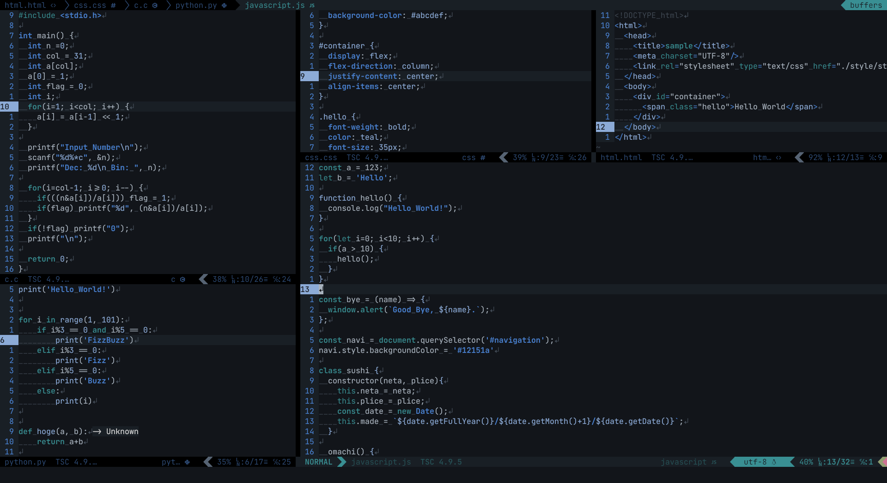

# PapilioDehaanii.vim


## Features

- Duotone color scheme for Vim and Neovim
    
- Airline support
    
    
    
    
    
    
- Terminal color support

## Installation

You can install this plugin using your favorite package manager.  
For example, if you use dein, execute

```vim
call dein#add('keiyakeiya/PapilioDehaanii.vim')
```

## Usage

```vim
colorscheme papilio_dehaanii
```

## License

MIT License. See [LICENSE](https://github.com/keiyakeiya/PapilioDehaanii.vim/blob/main/LICENSE)
